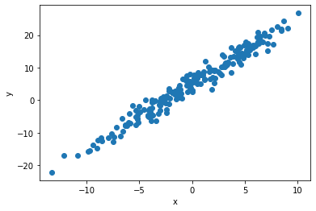
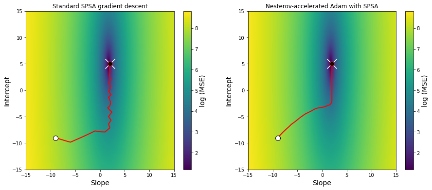
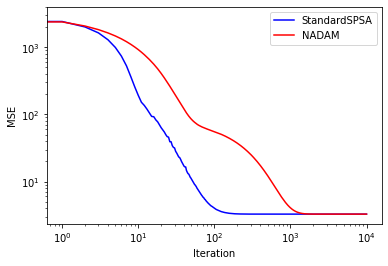

# gradless


This is an implementation of gradient descent designed to work without access to the exact gradient. To deal with this problem, it uses James Spall's [simultaneous perturbation stochastic approximation (SPSA)](https://www.jhuapl.edu/SPSA/PDF-SPSA/Spall_An_Overview.PDF) to replace the missing gradient. 

SPSA is particularly useful for optimization problems where the objective function itself is noisy, such that the exact gradient cannot be evaluated. For example, if the model at hand is evaluated by simulations rather than exact computations. This is in contrast to more typical applications of stochastic gradient descent, where the gradient can be computed, but noise is introduced through subsampling of the data (e.g. minibatching) or by Monte Carlo integration (e.g. in variational inference). 

## Purpose

This is a library I'm developing for use in a research problem of personal interest involving a noisy objective function. As such, it is both still in development and likely to be tailored toward my needs. My principle aim in writing this library is to have a structured, modular, and easy-to-modify framework with a defined API, separate from the actual model I'm working on so that the problem and the tools being applied to the problem are kept separate. My hope is this will make my research workflow cleaner and more efficient.

I decided to use this as an opportunity to try incorporating literate programming, as accomplished by [```nbdev```](https://github.com/fastai/nbdev), into my development workflow. I've been relying heavily on Jupyter notebooks to document my analyses by interspersing code and narrative. Extending this programming style to script development seemed like a good idea. In brief, ```nbdev``` provides a set of tools for organizing a Python project as set of Jupyter notebooks. All of the actual development takes place in those Jupyter notebooks, rather than an IDE. ```nbdev``` then extracts all code in cells marked with the header ```#export``` to a set of Python scripts and generates documentation from the markdown cells and code cells not labelled ```#export``` or ```#hide```. So far I have found ```nbdev``` a painless and natural approach to writing scripts and really enjoy it (I know I sound like a shill, but it really feels like a phenomenal and transformative tool). These scripts, documentation, and webpage found [here](laptopbiologist.github.io/gradless) were all automatically generated by ```nbdev``` from the ```*.ipynb``` notebooks found in the repository's main directory.  

As this is still in development and geared for personal use, I can't make any general guarantees about its performance or behavior. So if you must use it, use with caution and skepticism.


## To do

* Incorporate just-in-time compilation with JAX to speed up time-consuming functions
* Define a class to organize minibatching. Probably class that wraps datasets along with instructions for how to minibatch the data. This would be called by the `Model` class when it evaluates the cost function with data. May need to modify `Model` a bit in terms of how it stores and uses ```self.data```.
* Implement some procedures for smart hyperparameter choice

## Related packages

[noisyopt](https://github.com/andim/noisyopt) provides an implementation of SPSA along with another approach to optimizing noisy objective functions. 

For objective functions that aren't noisy [JAX](https://github.com/google/jax) provides tools for automatically computing the gradients of python functions.


## Example usage

Below is a very simple toy example, just to demonstrate how the API works. 


First we'll import the packages that we need.

```python
import numpy
import scipy
from matplotlib import pyplot
import seaborn
import scipy.stats
from tqdm import tqdm

from gradless import optimizers, costs, gradient, updates

```

### Simple linear regression

Let's say we are interested in fitting a simple linear regression a simple linear regression to some data.

First, I'll generate 200 data points from a simple linear relationship, with a slope of 2 and an intercept of 5

```python
x=scipy.stats.norm.rvs(0, 5, size=200)
err=scipy.stats.norm.rvs(0, 2, size=200)
slope=2
intercept=5
y=x*slope+intercept +err
pyplot.scatter(x,y)
pyplot.ylabel('y')
pyplot.xlabel('x')

```


    Text(0.5, 0, 'x')





Let's organized this data as a dictionary

```python
data={'x':x,
     'y':y}
```

Now we need a function that takes a vector of parameter values and data and uses these to returns a float to be minimized. The mean-squared error is pretty appropriate objective function here. 

Note that it does not matter how the data is organized, so long as the function can interpret it internally.


```python
def MSE(theta, data):
    x,y=data['x'], data['y']
    y_pred=theta[0]*x+theta[1]
    return numpy.mean((y-y_pred)**2)
```

Okay, now we'll create the model to be optimized by wrapping the cost function and the data in the `Model` class

```python
mse_cost=costs.Model(cost=MSE, data=data)
```

We'll fit this using the standard SPSA gradient descent algorithm described [here](https://www.jhuapl.edu/SPSA/PDF-SPSA/Spall_An_Overview.PDF). To do this, we're going to construct an instance of the `GradientDescent` class, passing it the model, an initial guess, and an update rule.

First, we'll choose an update rule from the `updates` submodule, creating an instance of the `StandardSPSA` class.

```python
update_rule=updates.StandardSPSA(max_step=1)
```

The ```max_step``` argument can be used to limit how much parameters are allowed to be updated in a single iteration, which can serve as a heuristic to limit divergences, especially in the early iterations where the learning rate is high. If the proposed step updates a parameter by more than ```max_step```, the entire proposed step is rescaled such that no parameter is updated by more than ```max_step```.

Now we'll create an instance of the `GradientDescent` optimizer. `GradientDescent` objects wrap the `Model` to be optimized along with update rules that are used to optimize the parameters.

```python
starts=numpy.array([-9,-9]) #Here's our initial guess
opt_vanilla=optimizers.GradientDescent(x_0 = starts,
                                       cost = mse_cost,
                                       update = update_rule,
                                       gradient=gradient.SPSAGradient(numpy.array([0,0])),
                                       param_stepsize=.1, param_stepdecay=0.5, param_decay_offset=0, 
                                       grad_stepsize=1, grad_stepdecay=.3, )
```

Note that there are additional parameters that need to be defined. The arguments beginning with ```param``` all control how much the parameters will be updated at each iteration and how this decays over time. The two arguments beginning with ```grad``` control how much the model parameters will be perturbed during the gradient approximation. It may be necessary to tune these parameters to work with a given model.

The primary way to interact with the `GradientDescent` optimizer is by calling the ```update_params``` method of the `GradientDescent` instance, which performs a single update of the model parameters. Doing this iteratively allows us to the fit model.

(Note that [```tqdm```](https://tqdm.github.io/) is a really great library for the impatient, as it automatically creates a progress bar so you can check the optimizer's progress.)

```python
for i in tqdm(range(10000)):
    opt_vanilla.update_params(gradient_reps=3)

```

    100%|██████████| 10000/10000 [00:03<00:00, 3056.86it/s]


 ```gradient_reps``` determines how many gradient approximations are estimated and averaged during each parameter update.


We could also have employed other gradient descent update rules, for example Adam, which uses the history of prior gradients to make (hopefully) more informed updates.

```python
update_rule=updates.ADAM( beta1=.9)
opt_NADAM=optimizers.GradientDescent(starts,mse_cost,update_rule,gradient.SPSAGradient(numpy.array([0,0])),param_stepsize=1, param_stepdecay=0.5, param_decay_offset=0, 
                 grad_stepsize=1, grad_stepdecay=.2, )
```

```python

for i in tqdm(range(10000)):
    opt_NADAM.update_params(gradient_reps=3)

```

    100%|██████████| 10000/10000 [00:03<00:00, 3204.98it/s]


Let's visualize the progress of the parameter updates in these two models. 

We can access the parameter values at the current iteration in the ```GradientDescent.theta``` attribute, the history of parameter estimates in ```GradientDescent.theta_hist```. 


    Text(0.5, 1.0, 'Nesterov-accelerated Adam with SPSA')





ADAM follows smoother path to the true parameter value (white X), but both arrive there despite relying on an approximation of the gradient.

We can access the history of the cost function over the iterations in ```GradientDescent.cost_history```. Examining this can provide some intuition about how the optimizer progressed: 

```python
pyplot.plot(opt_vanilla.cost_history,c='blue', label='StandardSPSA')
pyplot.plot(opt_NADAM.cost_history,c='red', label='NADAM')
pyplot.xscale('log')
pyplot.ylabel('MSE')
pyplot.xlabel('Iteration')
pyplot.yscale('log')
pyplot.legend()
```


    <matplotlib.legend.Legend at 0x7fb5cddd8cf8>





In this case, the standard SPSA update appears to converge more rapidly, though this may not be a perfectly fair comparison in terms of step sizes.
