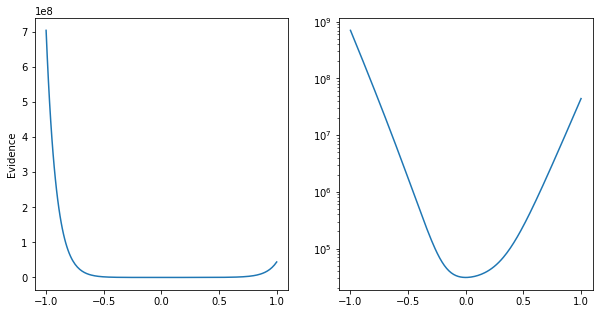
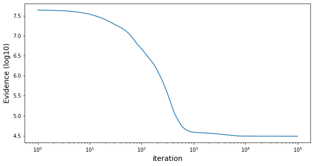
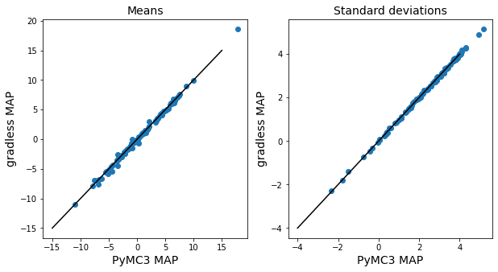
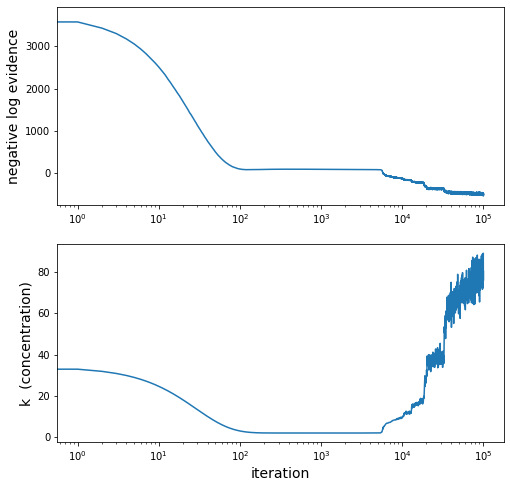
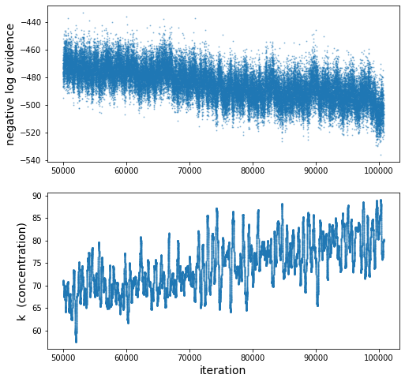
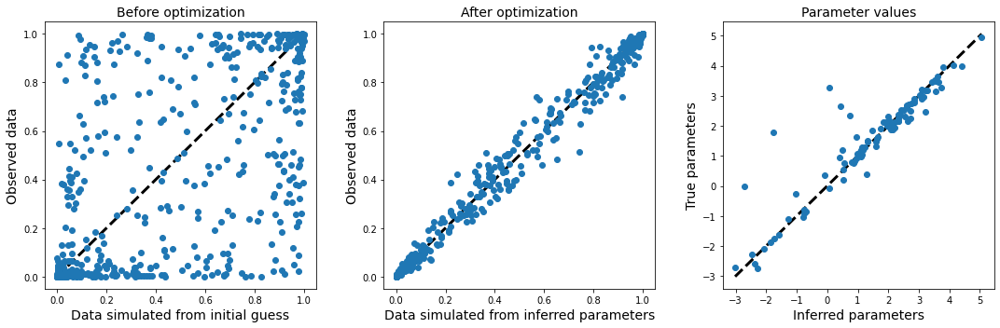

# gradless


This is an implementation of gradient descent designed to work without access to the exact gradient. To deal with this problem, it uses James Spall's [simultaneous perturbation stochastic approximation (SPSA)](https://www.jhuapl.edu/SPSA/PDF-SPSA/Spall_An_Overview.PDF) to replace the missing gradient. 

SPSA is particularly useful for optimization problems where the objective function itself is noisy, such that the exact gradient cannot be evaluated. For example, if the model at hand is evaluated by simulations rather than exact computations. This is in contrast to more typical applications of stochastic gradient descent, where the gradient can be computed, but noise is introduced through subsampling of the data (e.g. minibatching) or by Monte Carlo integration (e.g. in variational inference). 

## Purpose

This is a library I'm developing for use in a research problem of personal interest involving a noisy objective function. As such, it is both still in development and likely to be tailored toward my needs. My principle aim in writing this library is to have a structured, modular, and easy-to-modify framework with a defined API, separate from the actual model I'm working on so that the problem and the tools being applied to the problem are kept separate. My hope is this will make my research workflow cleaner and more efficient.

I decided to use this as an opportunity to try incorporating literate programming, as accomplished by [```nbdev```](https://github.com/fastai/nbdev), into my development workflow. I've been relying heavily on Jupyter notebooks to document my analyses by interspersing code and narrative. Extending this programming style to script development seemed like a good idea. In brief, ```nbdev``` provides a set of tools for organizing a Python project as set of Jupyter notebooks. All of the actual development takes place in those Jupyter notebooks, rather than an IDE. ```nbdev``` then extracts all code in cells marked with the header ```#export``` to a set of Python scripts and generates documentation from the markdown cells and code cells not labelled ```#export``` or ```#hide```. So far I have found ```nbdev``` a painless and natural approach to writing scripts and really enjoy it (I know I sound like a shill, but it really feels like a phenomenal and transformative tool). These scripts, documentation, and webpage found [here](laptopbiologist.github.io/gradless) were all automatically generated by ```nbdev``` from the ```*.ipynb``` notebooks found in the repository's main directory.  

As this is still in development and geared for personal use, I can't make any general guarantees about its performance or behavior. So if you must use it, use with caution and skepticism.


## To do

* Incorporate just-in-time compilation with JAX to speed up time-consuming functions
* Define a class to organize minibatching. Probably class that wraps datasets along with instructions for how to minibatch the data. This would be called by the ```Model``` class when it evaluates the cost function with data. May need to modify ```Model``` a bit in terms of how it stores and uses ```self.data```.
* Implement some procedures for smart hyperparameter choice

## Relates packages

[noisyopt](https://github.com/andim/noisyopt) provides an implementation of SPSA along with another approach to optimizing noisy objective functions. 

For objective functions that aren't noisy [JAX](https://github.com/google/jax) provides tools for automatically computing the gradients of python functions.


## Example usage

Below are a few toy examples, just to demonstrate how the API works. 

First we'll import the packages that we need.

```python
import numpy
import scipy
from matplotlib import pyplot
import seaborn
import scipy.stats
from tqdm import tqdm

from gradless import optimizers, costs, gradient, updates

```

### Simple linear regression

Let's say we are interested in fitting a simple linear regression a simple linear regression to some data.

First, I'll generate 200 data points from a simple linear relationship, with a slope of 2 and an intercept of 5:


$$x \sim normal(0, 5)$$



$$\epsilon \sim normal(0,2)$$



$$y=2x+5+\epsilon$$



```python
x=scipy.stats.norm.rvs(0, 5, size=200)
err=scipy.stats.norm.rvs(0, 2, size=200)
slope=2
intercept=5
y=x*slope+intercept +err
pyplot.scatter(x,y)
pyplot.ylabel('y')
pyplot.xlabel('x')

```


    Text(0.5, 0, 'x')


Let's organized this data as a dictionary

```python
data={'x':x,
     'y':y}
```

Now we need a function that takes a vector of parameter values and data and uses these to returns a float to be minimized. The mean-squared error is pretty appropriate objective function here. 

Note that it does not matter how the data is organized, so long as the function can interpret it internally.


```python
def MSE(theta, data):
    x,y=data['x'], data['y']
    y_pred=theta[0]*x+theta[1]
    return numpy.mean((y-y_pred)**2)
```

Okay, now we'll create the model to be optimized by wrapping the cost function and the data in the ```Model``` class

```python
mse_cost=costs.Model(cost=MSE, data=data)
```

We'll fit this using the standard SPSA gradient descent algorithm described [here](https://www.jhuapl.edu/SPSA/PDF-SPSA/Spall_An_Overview.PDF). To do this, we're going to construct an instance of the ```GradientDescent``` class, passing it the model, an initial guess, and an update rule.

First, we'll choose an update rule from the ```updates``` submodule, creating an instance of the ```StandardSPSA``` class.

```python
update_rule=updates.StandardSPSA(max_step=1)
```

The ```max_step``` argument can be used to limit how much parameters are allowed to be updated in a single iteration, which can serve as a heuristic to limit divergences, especially in the early iterations where the learning rate is high. If the proposed step updates a parameter by more than ```max_step```, the entire proposed step is rescaled such that no parameter is updated by more than ```max_step```.

Now we'll create an instance of the ```GradientDescent``` optimizer. ```GradientDescent``` objects wrap the ```Model``` to be optimized along with update rules that are used to optimize the parameters.

```python
starts=numpy.array([-9,-9]) #Here's our initial guess
opt_vanilla=optimizers.GradientDescent(x_0 = starts,
                                       cost = mse_cost,
                                       update = update_rule,
                                       gradient=gradient.SPSAGradient(numpy.array([0,0])),
                                       param_stepsize=.1, param_stepdecay=0.5, param_decay_offset=0, 
                                       grad_stepsize=1, grad_stepdecay=.3, )
```

Note that there are additional parameters that need to be defined. The arguments beginning with ```param``` all control how much the parameters will be updated at each iteration and how this decays over time. The two arguments beginning with ```grad``` control how much the model parameters will be perturbed during the gradient approximation. It may be necessary to tune these parameters to work with a given model.

The primary way to interact with the ```GradientDescent``` optimizer is by calling the ```update_params``` method of the ```GradientDescent``` instance, which performs a single update of the model parameters. Doing this iteratively allows us to the fit model.

(Note that [```tqdm```](https://tqdm.github.io/) is a really great library for the impatient, as it automatically creates a progress bar so you can check the optimizer's progress.)

```python
for i in tqdm(range(10000)):
    opt_vanilla.update_params(gradient_reps=3)

```

    100%|██████████| 10000/10000 [00:03<00:00, 3056.86it/s]


 ```gradient_reps``` determines how many gradient approximations are estimated and averaged during each parameter update.


We could also have employed other gradient descent update rules, for example Adam, which uses the history of prior gradients to make (hopefully) more informed updates.

```python
update_rule=updates.ADAM( beta1=.9)
opt_NADAM=optimizers.GradientDescent(starts,mse_cost,update_rule,gradient.SPSAGradient(numpy.array([0,0])),param_stepsize=1, param_stepdecay=0.5, param_decay_offset=0, 
                 grad_stepsize=1, grad_stepdecay=.2, )
```

```python

for i in tqdm(range(10000)):
    opt_NADAM.update_params(gradient_reps=3)

```

    100%|██████████| 10000/10000 [00:03<00:00, 3204.98it/s]


Let's visualize the progress of the parameter updates in these two models. 

We can access the parameter values at the current iteration in the ```GradientDescent.theta``` attribute, the history of parameter estimates in ```GradientDescent.theta_hist```. 


    Text(0.5, 1.0, 'Nesterov-accelerated Adam with SPSA')


ADAM follows smoother path to the true parameter value (white X), but both arrive there despite relying on an approximation of the gradient.

We can access the history of the cost function over the iterations in ```GradientDescent.cost_history```. Examining this can provide some intuition about how the optimizer progressed: 

```python
pyplot.plot(opt_vanilla.cost_history,c='blue', label='StandardSPSA')
pyplot.plot(opt_NADAM.cost_history,c='red', label='NADAM')
pyplot.xscale('log')
pyplot.ylabel('MSE')
pyplot.xlabel('Iteration')
pyplot.yscale('log')
pyplot.legend()
```


    <matplotlib.legend.Legend at 0x7fb5cddd8cf8>


In this case, the standard SPSA update appears to converge more rapidly, though this may not be a perfectly fair comparison in terms of step sizes.

### A high dimensional model: Fitting a 100-dimensional Gaussian

A major advantage of SPSA is that unlike the finite-differences approximation of the gradient (which perturbs each model parameter separately), SPSA requires only two evaluations of the cost function per gradient estimate irrespective of the model's dimension. This makes SPSA an appealling tool for optimizing high-dimensional models.

Let's say we want to fit the means and standard deviations of a 100-dimensional Gaussian to some data, so we have 200 parameters that we want to estimate.

```python
ndim=100
means=scipy.stats.norm.rvs(0, 5, size=ndim)
sd=numpy.abs(scipy.stats.norm.rvs(0,10, size=ndim))
data=scipy.stats.norm.rvs(means, sd, size=(100,ndim))
true_param=numpy.zeros(2*ndim)
true_param[::2]=means
true_param[1::2]=numpy.log2(sd)
```

We could frame this as Bayesian generative model


$$\mu_1 .. \mu_{100} \sim Normal(0,10)$$


$$\sigma_1 .. \sigma_{100} \sim LogNormal(0,5)$$


$$X \sim MultivariateNormal(\mu, \sigma)$$


and we could aim to identify a maximum a posteriori estimate of the model parameters.

For speed, I'm going to write the function the computes the negative log-evidence using the version of Scipy implemented in [JAX](https://github.com/google/jax), and wrap it with ```@jit``` decorate to create a compiled version of the evidence which will be much faster.

```python
import jax.numpy as jnp
import jax.scipy as jsc
from jax import jit

@jit
def evidence(theta, data):
    #priors
    mu=theta[::2]
    sd=theta[1::2]

    mu_prior=jsc.stats.norm.logpdf(mu, 0, 10).sum()
    sd_prior=jsc.stats.norm.logpdf(sd, 0, 5).sum()
    
    loglk=jsc.stats.norm.logpdf(data, mu,2.**(sd)).sum()
    return -(mu_prior+sd_prior+loglk)

```

Let's choose an initial guess for the optimizer and compare the negative log-evidence at the initial guess to that at the true parameter values.

```python
starts=scipy.stats.norm.rvs(0,3, size=means.shape[0]+sd.shape[0])
starts[::2]=scipy.stats.norm.rvs(0,8, size=means.shape[0])
```

```python
print (f"neg log evidence(theta_0) = {evidence(starts, data)}")
print (f"neg log evidence(theta_true) = {numpy.round(evidence(true_param, data))}")
```

    neg log evidence(theta_0) = 44150716.0
    neg log evidence(theta_true) = 30946.0


    /home/mpm289/anaconda3/lib/python3.6/site-packages/jax/lib/xla_bridge.py:125: UserWarning: No GPU/TPU found, falling back to CPU.
      warnings.warn('No GPU/TPU found, falling back to CPU.')


That's a pretty nasty difference in magnitude! 

In this case, we know the true value from which the data were generated, so we can get a better look at this by plotting out what the negative log-evidence looks like on a line passing from the initial guess to the true parameter value (centered at zero in the plots below). If we didn't know what the true parameter value was, we could nonetheless make some reasonable estimates of the variation in magnitudes the optimizer would potentially be dealing with. For example, by simulating datasets from the generative model and applying this procedure to the simulated data where the true parameter values were know. 

I'll plot this in linear and log-scale:

```python
param_line=true_param[:,None]+numpy.linspace(-1,1,200)*(starts-true_param)[:,None]
cost=[]
noisy_cost=[]
for i in range (200):
    cost.append(evidence(param_line[:,i], data))

pyplot.figure(figsize=(10,5))
pyplot.subplot(121)
pyplot.plot(numpy.linspace(-1,1,200), cost)
pyplot.ylabel('Evidence')
pyplot.subplot(122)
pyplot.plot(numpy.linspace(-1,1,200), cost)
pyplot.yscale('log')

```





In linear scale this is quite hard to interpret, and seems likely to give an optimizer some problems, given how much the gradients will vary in scale as it explores the parameter space. The gradients are going to vary over a wide range of magnitudes, which make it hard for me to think about what sorts of step sizes are reasonable. And step sizes that work well when the gradient is extremely steep will work poorly once they become shallow (and vice versa).

However, the log-transformation is not universally appropriate for transforming negative log-likelihoods/probabilites, because they can in some circumstances be negative. Instead, if we wish to squish the scale spanned by the cost function the inverse hyperbolic sine transform (```math.arcsinh_transfrom```) is a better option. So we'll use this to transform the log-evidence so that the gradients are more consistent in scale.

```python
from gradless.math import arcsinh_transform
model=costs.Model( arcsinh_transform(evidence),
                  data)

update_rule=updates.NADAM(beta1=.99,max_step=.05)
opt=optimizers.GradientDescent(starts,model,update_rule,gradient.SPSAGradient([0,1]*ndim),
                               acceptance_rule=updates.BlockWithLocalResiduals(2,100),
                               param_stepsize = 1, param_stepdecay = .4, param_decay_offset = 0, 
                               grad_stepsize = 1, grad_stepdecay = .2, )

for i in tqdm(range(100000)):
    opt.update_params(gradient_reps=1, block_val=None)

```

      0%|          | 0/100000 [00:00<?, ?it/s]/home/mpm289/projects/gradless/gradless/gradient.py:99: RuntimeWarning: divide by zero encountered in true_divide
      ghat=(yplus-yminus)/(2*ck*delta)
      1%|          | 876/100000 [00:01<03:03, 539.78it/s]/home/mpm289/projects/gradless/gradless/gradient.py:99: RuntimeWarning: invalid value encountered in true_divide
      ghat=(yplus-yminus)/(2*ck*delta)
    100%|██████████| 100000/100000 [03:04<00:00, 543.04it/s]


Let's visualize how the cost function improved over the iterations.

```python
#hide_inputs
pyplot.figure(figsize=(10,5))
# pyplot.subplot(121)
pyplot.plot(numpy.arange(len(opt.cost_history))+1, numpy.log10(numpy.exp(opt.cost_history)))
xscal=pyplot.xscale('log')
xlab=pyplot.xlabel('iteration', size=14)
ylab=pyplot.ylabel('Evidence (log10)', size=14)
# pyplot.subplot(122)
# pyplot.plot(numpy.log10(numpy.exp(opt.cost_history))[50000:])

```





Let's compare this to a MAP estimate obtained using PyMC3. I'll set up the model and draw samples from the posterior using the No-U-Turn Sampler (NUTS).

```python
import pymc3 as pm
with pm.Model() as model:
    mu=pm.Normal('mu',0,10, shape=ndim)
    std=2.**pm.Normal('sd',0,5, shape=ndim)
    obs=pm.Normal('obs',mu, std, observed=data)
with model:
#     trace=pm.sample()
    MAP=pm.find_MAP()
    
mean_mu=MAP['mu']
sd_mu=MAP['sd']
```


<div>
    <style>
        /* Turns off some styling */
        progress {
            /* gets rid of default border in Firefox and Opera. */
            border: none;
            /* Needs to be in here for Safari polyfill so background images work as expected. */
            background-size: auto;
        }
        .progress-bar-interrupted, .progress-bar-interrupted::-webkit-progress-bar {
            background: #F44336;
        }
    </style>
  <progress value='329' class='' max='329' style='width:300px; height:20px; vertical-align: middle;'></progress>
  100.00% [329/329 00:00<00:00 logp = -30,837, ||grad|| = 0.29291]
</div>


    


For a problem like this, ```PyMC3``` is absolutely a better choice, because objective function is not noisy. So it also serves as a nice sanity. PyMC3 uses Theano to accomplish automatic differentiation (I believe they are beginning to migrate to ```JAX```), and so it makes use of the the exact gradient. Despite only using an approximation of the gradient, SPSA arrives at essentially the same answer. The price, of course, is that it took three minutes rather than a second to run. 

```python
#hide_inputs
theta_hist=numpy.array(opt.theta_hist)
pyplot.figure(figsize=(10,5))
pyplot.subplot(121)
pyplot.title('Means', size=14)
pyplot.scatter(theta_hist[-1,::2], (mean_mu))
pyplot.plot([-15,15],[-15,15], color='black')
pyplot.xlabel('PyMC3 MAP', size=14)
pyplot.ylabel('gradless MAP', size=14)
pyplot.subplot(122)
pyplot.title('Standard deviations', size=14)
pyplot.scatter(theta_hist[-1,1::2], (sd_mu))
pyplot.plot([-4,4],[-4,4], color='black')
pyplot.xlabel('PyMC3 MAP', size=14)
txt=pyplot.ylabel('gradless MAP', size=14)
```





### A more realistic use case: A high-dimensional model with a noisy objective function

Consider a simulator that relates some set of parameters to data. Even though the simulator is able to relate parameters to data, we may not know to how to express this relationship exactly. For example, perhaps the math involves an intractable sum or maybe we don't even know how the simulator works under the hood. Nonetheless we want to use the simulator to figure which set of parameters best describes some data or observations.

Let's say we have a specific simulator, and we know a few things about its parameters (because they are meaningful things that we care about), but we don't know how to exactly reason about the relationship between these parameters and the outputs (i.e. data, observations) of the system of interest. Let's say this simulator takes in a set of 100 parameters $\theta$ and some depedendent variables $X$ and generates some outputs $Y$:


$$ Y_i \sim simulator(X_i ; \theta)$$


We know that the parameters $\theta$ are positive real numbers and that they should be passed to the simulator in log-scale. We also have a sense of the range of values these parameter would typically vary over. We also know that each $Y_i$ will have a value between zero and one.

```python
import pickle
with open('examples/00_data/data.pckl', 'rb') as handle:
    simulation_dict=pickle.load(handle)
```

```python
data={'output': numpy.exp(simulation_dict['data']),
     'indep_var1': simulation_dict['indep_var1'],
     'indep_var2': simulation_dict['indep_var2']}
```

Because $Y$ lives between zero and one, we might frame trying to predict the observed $Y$ based on the dependent variables $X$ as a beta regression model. We could treat the simulator as a (probably non-linear) function which transforms each $X_i$ and $\theta$ into a prediction of $Y_i$ (the mode of the beta distribution). Finally, we'll express the noisiness in these prediction of $Y_i$ with a concentration parameter $k$. We might write this model out as


$$\theta \sim Normal(0,2)$$


$$k \sim HalfNormal( shift = 2, \sigma = 200)$$



$$\hat{Y_i} \sim simulator(X_i; \theta)$$



$$\alpha_i =\hat{Y_i}(k-2)+1$$


$$\beta_i =(1-\hat{Y_i})(k-2)+1$$



$$Y_i \sim beta(\alpha_i, \beta_i)$$


And we can now write out an estimator of the model's negative log-evidence in a function that calls the simulator each time it is evaluated.

```python
rvs=JaxBernoulli((1000,50),50,0)  #Random number generator needed by the simulator

def model_evidence(theta, data):
    obs=(data['output'])
    k=2.**theta[-1]+2
    params_1=theta[50:-1]
    params_2=theta[:50]
    mu=numpy.exp(
        numpy.array(
            simulator(data['indep_var1'],
                   params_1,
                  params_2,
                 data['indep_var2'], 
                   rvs.rvs)))
    a=(mu)*(k-2)+1
    b=(1-mu)*(k-2)+1
    
    prior_1=scipy.stats.norm.logpdf(params_1,0,2).sum()
    prior_2=scipy.stats.norm.logpdf(params_2,0,2).sum()
    prior_k=scipy.stats.halfnorm.logpdf(k-1,0,200)
    loglk=scipy.stats.beta.logpdf(obs,a,b).sum()
    return -(prior_k+prior_1+prior_2+ loglk)
```

Okay, we'll initialize the optimizer at the prior mode and the apply the ```arcsinh_transform``` to the evidence.

```python
from gradless.math import arcsinh_transform

starts=numpy.zeros(100)
start_with_conc=numpy.hstack([starts,[5]])
#Arcsinh transform the evidence
model_lk=costs.Model(arcsinh_transform (model_evidence),
                  data)

update_rule_lk=updates.NADAM(beta1=.99,max_step=.05)
opt_lk=optimizers.GradientDescent(start_with_conc,model_lk,update_rule_lk,gradient.SPSAGradient([0]*101),
                               acceptance_rule=updates.BlockWithLocalResiduals(2,100),
                               param_stepsize = 1, param_stepdecay = .4, param_decay_offset = 0, 
                               grad_stepsize = 1, grad_stepdecay = .2,,seed=0 )


```

```python
for i in tqdm(range(500)):
    opt_lk.update_params(gradient_reps=1, block_val=None)
```

    100%|██████████| 500/500 [00:07<00:00, 68.18it/s]


```python
for i in tqdm(range(50000)):
    opt_lk.update_params(gradient_reps=1, block_val=None)
```

    100%|██████████| 50000/50000 [12:17<00:00, 67.76it/s]


```python
for i in tqdm(range(50000)):
    opt_lk.update_params(gradient_reps=1, block_val=None)
```

    100%|██████████| 50000/50000 [12:24<00:00, 67.16it/s]


Now let's visualize the objective function over time





One thing that is interesting to note is that the noise in the objective function increases as the parameters are optimized (note that width of the line in the top plot increases as the the iterations progress). 

This corresponds to an increase in the concentration parameter ($k$, bottom plot), which is inversely related to how well the model thinks the simulator describes the observed data. This makes sense, as when $k$ is small the model assumes that the simulator is a poor description of the observed data and so randomness in the simulation outputs has little impact on the likelihood. 

So initially, when the simulation parameters are poor descriptions of the data, the optimizer drive $k$ toward its minimum allowed value. As the optimizer begins to identify more reasonable parameters, the simulations become better descriptions of the data, and the optimizer begins to increase $k$ to reflect this. However, as $k$ increases, the model treats the simulations as better descriptions of the observed data, and so randomness in the simulation outputs now have a noticeable impact on the likelihood.

Let's zoom in how the objective function and the concentration parameters were evolving over the last 50,000 iterations





Neither of them appear to have leveled off yet--the objective function is gradually trending downward and the concentration parameter is gradually increasing--so the optimizer probably hasn't converged yet and should probably be run for more iterations. But I'm impatient, so let's look at the fit.





So, after optimization we have clearly obtained a pretty reasonable set of parameters for the observed data. That is, when fed into the simulator, the inferred parameters generate data that looks very similar to the observed data. Whether this is a good enough estimate is a question for further consideration and potentially more analysis. 

In this case, because I simulated the data myself, I know the the true parameter values and can the check the results against that. Most (~95) of the parameters have been correctly estimated, however five parameters appear to have been underestimated. This could reflect that the optimizer has not yet converged and more iterations should be performed (or the learning rate should be adjusted to hopefully achieve faster convergence). I think that both the concentration parameter and the objective look to be moving a clear trend support this interpretation.

Another possibility, though, is that some of the simulators parameters are not strongly informed by the data. Running multiple optimizers from different initial values could help evaluate whether the model has converged. Similarly, expanding from point estimation to also trying to the estimate the uncertainty about parameters (for example, with variational inference) might help better evaluate whether some parameters are simply hard to estimate. 


