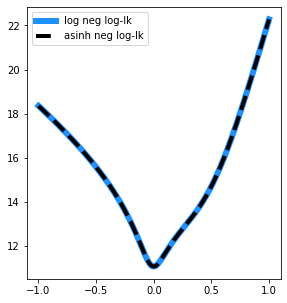
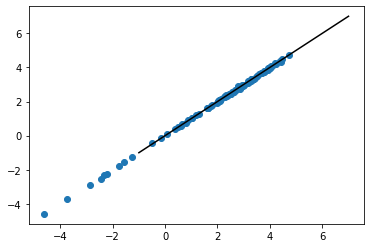
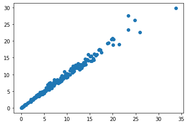

# gradless


This is an implementation of gradient descent designed to work without access to the exact gradient. To deal with this problem, it uses James Spall's [simultaneous perturbation stochastic approximation (SPSA)](https://www.jhuapl.edu/SPSA/PDF-SPSA/Spall_An_Overview.PDF) to replace the missing gradient. 

SPSA is particularly useful for optimization problems where the objective function itself is noisy, such that the exact gradient cannot be evaluated. For example, if the model at hand is evaluated by simulations rather than exact computations. This is in contrast to more typical applications of stochastic gradient descent, where the gradient can be computed, but noise is introduced through subsampling of the data (e.g. minibatching) or by Monte Carlo integration (e.g. in variational inference). 

## Goals

This is a library I'm developing for use in a research problem of personal interest involving a noisy objective function. As such, it is both still in development and likely to be tailored toward my needs. My principle aim in writing this library is to have a structured, modular, and easy-to-modify framework with a defined API, separate from the actual model I'm working on so that the problem and the tools being applied to the problem are kept separate, hopefully making my research workflow cleaner and more efficient.

I decided to use this as an opportunity to try incorporating literate programming, as accomplished by [```nbdev```](https://github.com/fastai/nbdev), into my development workflow. I've been relying heavily on Jupyter notebooks to document my analyses by interspersing code and narrative. Extending this programming style to script development seemed like a good idea. In brief, ```nbdev``` provides a set of tools for organizing a Python project as set of Jupyter notebooks. All of the actual development takes place in those Jupyter notebooks, rather than an IDE. ```nbdev``` then extracts all code in cells marked with the header ```#export``` to a set of Python scripts and generates documentation from the markdown cells and code cells not labelled ```#export``` or ```#hide```. I am very much enjoying ```nbdev``` and have so far found it a painless and natural approach to writing scripts, and actually getting documentation done (I know I sound like a shill, but it really feels like a phenomenal and transformative tool). This scripts, documentation, and webpage found [here](laptopbiologist.github.io/gradless) were all automatically generated by ```nbdev``` from the ```*.ipynb``` notebooks found in the repositories main directory.  

As this is still in development and geared for personal use, I can't make any general guarantees about its performance or behavior. So if you must use it, use with caution and skepticism.


## To do

* Incorporate just-in-time compilation with JAX to speed up time-consuming functions
* Define a class to organize minibatching. Probably class that wraps datasets along with instructions for how to minibatch the data. This would be called by the ```Model``` class when it evaluates the cost function with data. May need to modify ```Model``` a bit in terms of how it stores and uses ```self.data```.
* Implement some procedures for smart hyperparameter choice

## Similar packages


[noisyopt](https://github.com/andim/noisyopt) provides an implementation of SPSA along with another approach to optimizing noisy objective functions. 


## Example usage

Okay, let's try out a few toy examples, just to demonstrate how the API works. 

First we'll import the packages that we need.


```python
import numpy
import scipy
from matplotlib import pyplot
import seaborn

from tqdm import tqdm

from gradless import optimizers, costs, gradient, updates
```

### Simple linear regression

Let's say we are interested in the mean-squared error of a simple linear regression.


Now let's generate 200 data points from a simple linear relationship, with a slope of 2 and an intercept of 5:


$$x \sim normal(0, 5)$$



$$\epsilon \sim normal(0,2)$$



$$y=2x+5+\epsilon$$



```python
x=scipy.stats.norm.rvs(0, 5, size=200)
err=scipy.stats.norm.rvs(0, 2, size=200)
slope=2
intercept=5
y=x*slope+intercept +err
pyplot.scatter(x,y)
pyplot.ylabel('y')
pyplot.xlabel('x')

```


    Text(0.5, 0, 'x')


Let's organized this data as a dictionary

```python
data={'x':x,
     'y':y}
```

Now we need a function that takes a vector of parameter values and data and uses these to returns a float. Note that it does not matter how the data is organized, so long as the function can interpret it internally.


```python
def MSE(theta, data):
    x,y=data['x'], data['y']
    y_pred=theta[0]*x+theta[1]
    return numpy.mean((y-y_pred)**2)
```

Okay, now we'll wrap the cost function and the data in the ```Model``` class

```python
mse_cost=costs.Model(cost=MSE, data=data)
```

We'll fit this using the standard gradient descent algorithm described [hera](https://www.jhuapl.edu/SPSA/PDF-SPSA/Spall_An_Overview.PDF). To do this, we're going to construct an instance of the ```GradientDescent``` class, passing it the model, an initial guess, and an update rule.

First, we'll choose an update rule from the ```updates``` submodule, creating an instance of the ```StandardSPSA``` class.

```python
update_rule=updates.StandardSPSA(max_step=1)
```

Now we'll create an instance of the ```GradientDescent``` optimizer.

```python
starts=numpy.array([-9,-9]) #Here's our initial guess
opt_vanilla=optimizers.GradientDescent(x_0 = starts,
                                       cost = mse_cost,
                                       update = update_rule,
                                       gradient=gradient.SPSAGradient(numpy.array([0,0])),
                                       param_stepsize=.1, param_stepdecay=0.5, param_decay_offset=0, 
                                       grad_stepsize=1, grad_stepdecay=.3, )
```

Note that there are additional parameters that need to be defined. The arguments beginning with ```param``` all control the much the parameters will be updated at each iteration and how this decays over time. The two arguments beginning with ```grad``` control how much the model parameters will be perturbed during the gradient approximation. It may be necessary to tune these parameters to work with a given model.

Now we can optimize the model by iteratively calling the ```update_params``` method of the ```GradientDescent``` instance. Note that we can use the ```tqdm``` library to create a progress bar for the fit

```python
for i in tqdm(range(10000)):
    opt_vanilla.update_params(gradient_reps=3)

```

    100%|██████████| 10000/10000 [00:03<00:00, 3082.08it/s]


The ```max_step``` argument in ```update_params``` can be used to limit how much parameters are allowed to be updated in each iteration, which can served as heuristic to limit divergences, especially in the early iterations where the learning rate is high. ```gradient_reps``` determines how many gradient approximations are estimated and averaged during each parameter update.


We could also have employed other gradient descent update rules, for example Nestorov-accelerated Adam, which uses the history of prior gradients to make (hopefully) more informed updates.

```python
update_rule=updates.ADAM( beta1=.9)
opt_NADAM=optimizers.GradientDescent(starts,mse_cost,update_rule,gradient.SPSAGradient(numpy.array([0,0])),param_stepsize=1, param_stepdecay=0.5, param_decay_offset=0, 
                 grad_stepsize=1, grad_stepdecay=.2, )
```

Because this relies on the history o

```python

for i in tqdm(range(10000)):
    opt_NADAM.update_params(gradient_reps=3)

```

    100%|██████████| 10000/10000 [00:03<00:00, 3098.22it/s]


```python
X,Y,Z=[],[],[]
for slope in numpy.arange(-15, 15,.2):

    for intercept in numpy.arange(-15, 15,.2):
        Y.append(intercept)
        X.append(slope)
        Z.append(mse_cost.evaluate([slope,intercept]))

```

```python
pyplot.figure(figsize=(15,6))
pyplot.subplot(121)
theta_hist=numpy.array(opt_vanilla.theta_hist)
sc=pyplot.scatter(X,Y, c=numpy.log(Z), zorder=-1)
pyplot.scatter(starts[0], starts[1], c='white', edgecolor='black', s=100)
pyplot.plot(theta_hist[:,0],theta_hist[:,1], c='red', lw=2, zorder=0)
pyplot.scatter(2, 5, marker='x', c='white', s=400)
pyplot.scatter(theta_hist[-1,0],theta_hist[-1,1], marker='o',edgecolor='red', c='black', s=80)

cbar=pyplot.colorbar(sc)
cbar.set_label('log (MSE)', size=14)
pyplot.ylabel('Intercept', size=14)
pyplot.xlabel('Slope', size=14)
pyplot.xlim(-15,15)
pyplot.ylim(-15,15)
pyplot.title('Standard SPSA gradient descent')

pyplot.subplot(122)
theta_hist=numpy.array(opt_NADAM.theta_hist)
sc=pyplot.scatter(X,Y, c=numpy.log(Z), zorder=-1)
pyplot.scatter(starts[0], starts[1], c='white', edgecolor='black', s=100)
pyplot.plot(theta_hist[:,0],theta_hist[:,1], c='red', lw=2, zorder=0)
pyplot.scatter(2, 5, marker='x', c='white', s=400)
pyplot.scatter(theta_hist[-1,0],theta_hist[-1,1], marker='o',edgecolor='red', c='black', s=80)

cbar=pyplot.colorbar(sc)
cbar.set_label('log (MSE)', size=14)
pyplot.ylabel('Intercept', size=14)
pyplot.xlabel('Slope', size=14)
pyplot.xlim(-15,15)
pyplot.ylim(-15,15)
pyplot.title('Nesterov-accelerated Adam with SPSA')
```


    Text(0.5, 1.0, 'Nesterov-accelerated Adam with SPSA')


```python
pyplot.plot(opt_vanilla.cost_history,c='blue', label='StandardSPSA')
pyplot.plot(opt_NADAM.cost_history,c='red', label='NADAM')
pyplot.xscale('log')
pyplot.ylabel('MSE')
pyplot.xlabel('Iteration')
pyplot.yscale('log')
pyplot.legend()
```


    <matplotlib.legend.Legend at 0x7f7880254a90>


### Fitting the same regression with an intentionally bad loss function

Let's say instead that we decided to optimize this is in a pretty nonsensical fashion. Instead of just computing the loss as


$$\sum_i (y_i - \hat{y}_i)^2$$


we'll add a considerable amount of noise to each prediction and compute it as


$$\epsilon_1,...,\epsilon_n \sim Normal(\mu=0,\sigma =30)$$


$$\sum_i (y_i - (\hat{y}_i + \epsilon_i) )^2$$


This is essentially simulating a noisier dataset from the proposed parameters and the computing the distance between the y-values in the real and simulated data. 

```python
def MSE_simulated_data(theta, data):
    x,y=data['x'], data['y']
    y_pred=scipy.stats.norm.rvs( theta[0]*x+theta[1], 30.)
    
    return numpy.mean((y-y_pred)**2)
```

```python


```

Then we instatiate an instance of the ```GradientDescent``` class with the model, the initial guess, and the update rule.

```python

mse_sim_cost=costs.Model(MSE_simulated_data, data)
starts=numpy.array([-9,-9])
update_rule=updates.StandardSPSA(max_step=.1)
opt_vanilla=optimizers.GradientDescent(starts,mse_sim_cost,update_rule,
                                       gradient.SPSAGradient(numpy.array([0,0])),
                                       acceptance_rule=updates.BlockWithLocalResiduals(2,100),
                                       param_stepsize=.2, param_stepdecay=0.3, param_decay_offset=0, 
                                       grad_stepsize=1, grad_stepdecay=.2, )
```

```python
opt_vanilla.update_params(gradient_reps=100)
for i in tqdm(range(50000)):
    opt_vanilla.update_params(gradient_reps=3)

```

    100%|██████████| 50000/50000 [00:46<00:00, 1069.89it/s]


The ```max_step``` argument in ```update_params``` can be used to limit how much parameters are allowed to be updated in each iteration, which can served as heuristic to limit divergences, especially in the early iterations where the learning rate is high.

```python

mse_sim_cost=costs.Model(MSE_simulated_data, data)
starts=numpy.array([-9,-9])
update_rule=updates.NADAM( beta1=.9, max_step=.1)
opt_NADAM=optimizers.GradientDescent(starts,mse_sim_cost,update_rule,gradient.SPSAGradient(numpy.array([0,0])),
                                     acceptance_rule=updates.BlockWithLocalResiduals(2,100),
                                     param_stepsize=.2, param_stepdecay=0.3, param_decay_offset=0, 
                 grad_stepsize=1, grad_stepdecay=.2, )
```

```python
opt_NADAM.update_params(gradient_reps=100)
for i in tqdm(range(50000)):
    opt_NADAM.update_params(gradient_reps=3)

```

    100%|██████████| 50000/50000 [00:47<00:00, 1044.37it/s]


```python
X,Y,Z=[],[],[]
for slope in numpy.arange(-15, 15,.2):

    for intercept in numpy.arange(-15, 15,.2):
        Y.append(intercept)
        X.append(slope)
        Z.append(mse_sim_cost.evaluate([slope,intercept]))

```

```python
pyplot.figure(figsize=(15,6))
pyplot.subplot(121)
theta_hist=numpy.array(opt_vanilla.theta_hist)
sc=pyplot.scatter(X,Y, c=numpy.log(Z), zorder=-1)
pyplot.scatter(starts[0], starts[1], c='white', edgecolor='black', s=100)
pyplot.plot(theta_hist[:,0],theta_hist[:,1], c='red', lw=2, zorder=0)
pyplot.scatter(2, 5, marker='x', c='white', s=400)
pyplot.scatter(theta_hist[-1,0],theta_hist[-1,1], marker='o',edgecolor='red', c='black', s=80)

cbar=pyplot.colorbar(sc)
cbar.set_label('log (MSE)', size=14)
pyplot.ylabel('Intercept', size=14)
pyplot.xlabel('Slope', size=14)
pyplot.xlim(-15,15)
pyplot.ylim(-15,15)
pyplot.title('Standard SPSA gradient descent')

pyplot.subplot(122)
theta_hist=numpy.array(opt_NADAM.theta_hist)
sc=pyplot.scatter(X,Y, c=numpy.log(Z), zorder=-1)
pyplot.scatter(starts[0], starts[1], c='white', edgecolor='black', s=100)
pyplot.plot(theta_hist[:,0],theta_hist[:,1], c='red', lw=2, zorder=0)
pyplot.scatter(2, 5, marker='x', c='white', s=400)
pyplot.scatter(theta_hist[-1,0],theta_hist[-1,1], marker='o',edgecolor='red', c='black', s=80)

cbar=pyplot.colorbar(sc)
cbar.set_label('log (MSE)', size=14)
pyplot.ylabel('Intercept', size=14)
pyplot.xlabel('Slope', size=14)
pyplot.xlim(-15,15)
pyplot.ylim(-15,15)
pyplot.title('Nesterov-accelerated Adam with SPSA')
# pyplot.figure(figsize=(8,8))
# sc=pyplot.scatter(X,Y, c=numpy.log(Z), zorder=-1, s=20)
# pyplot.scatter(starts[0], starts[1], c='white', edgecolor='black', s=100)
# pyplot.plot(theta_hist[:,0],theta_hist[:,1], c='red', lw=2, zorder=0)
# pyplot.scatter(theta_hist[-1,0],theta_hist[-1,1], c='red', lw=2, zorder=0)
# pyplot.scatter(2, 5, marker='x', c='white', s=200)

# cbar=pyplot.colorbar(sc)
# cbar.set_label('log (MSE)', size=14)
# pyplot.ylabel('Intercept', size=14)
# pyplot.xlabel('Slope', size=14)
# pyplot.xlim(-15,15)
# pyplot.ylim(-15,15)
```


    Text(0.5, 1.0, 'Nesterov-accelerated Adam with SPSA')


```python
pyplot.plot(numpy.log(opt_NADAM.cost_history))
pyplot.xscale('log')
```


```python
pyplot.plot(numpy.log(opt_vanilla.cost_history))
pyplot.xscale('log')
```


It's likely that choosing different parameters for the step size of the standard SPSA gradient descent would lead to better performance.

### High dimensional model

```python
ndim=200
means=scipy.stats.norm.rvs(0, 5, size=ndim)
sd=numpy.abs(scipy.stats.norm.rvs(0,10, size=ndim))
data=scipy.stats.norm.rvs(means, sd, size=(100,ndim))
true_param=numpy.zeros(2*ndim)
true_param[::2]=means
true_param[1::2]=numpy.log2(sd)
```

```python
import jax.numpy as jnp
import jax.scipy as jsc
from jax import jit
def evidence_python(theta, data):
    #priors
    mu=theta[::2]
    sd=theta[1::2]

    mu_prior=jsc.stats.norm.logpdf(mu, 0, 10).sum()
    sd_prior=jsc.stats.norm.logpdf(sd, 0, 5).sum()
    
    loglk=jsc.stats.norm.logpdf(data, mu,2.**(sd)).sum()
    return -(mu_prior+sd_prior+loglk)

#Use just-in-time compiling to speed it up
evidence=jit(evidence_python)
```

Let's choose an intial guese for the optimizaer

```python
starts=scipy.stats.norm.rvs(0,3, size=means.shape[0]+sd.shape[0])
starts[::2]=scipy.stats.norm.rvs(0,8, size=means.shape[0])
```

```python
print (evidence(starts, data))
print (evidence(true_param, data))
```

    4725433300.0
    64599.24


In this case, we know the true values, so we can plot out what the negative log-likelihood looks like on a line passing from the initial guess to the true parameter value:

```python
param_line=true_param[:,None]+numpy.linspace(-1,1,200)*(starts-true_param)[:,None]
cost=[]
noisy_cost=[]
for i in range (200):
    cost.append(evidence(param_line[:,i], data))

pyplot.figure(figsize=(10,5))
pyplot.subplot(121)
pyplot.plot(numpy.linspace(-1,1,200), cost)

```


    [<matplotlib.lines.Line2D at 0x7f783c66f780>]


If we didn't know what the true parameter value was, we could nonetheless make some reasonable estimate of the magnitude. For example, simulating datasets from the generative model and compute 

In linear scale this, this is quite hard to interpret, and seems likely to give an optimizer some problems. Let's take a look a the log-transform of the negative log-likelihood:

```python
pyplot.figure(figsize=(10,5))
ax=pyplot.subplot(121)
pyplot.plot(numpy.linspace(-1,1,200), numpy.log(cost))

```


    [<matplotlib.lines.Line2D at 0x7f783c630780>]


This looks a lot better and easier to work with. So it will probably be easier to fit the model if we transform the function we're optimizing.

However, while the negative log-likelihood is often positive for many models, this will not necessarily be the case for all models. Probability density functions can return values greater than $1$ if the probability distribution is highly concentrated (for example, beta distributions do this frequently). In that case, the negative log-likelihood maybe negative, so a log-transformation cannot be applied to negative log-likelihoods in general.

An alternative in the inverse hyperbolic sine transformation (arcsineh): $asinh(\frac{x}{2})$. For large positives numbers, this is almost equivalent to the log-transform. For large negative numbers, this is almost equivalent to the negative of the log-transform. For smaller numbers, near zero, transformation is nearly linear and is almost equivalent to dividing them by $2$. That is, this transformation is always somewhere between a log-scale and linear-scale, being almost exactly log-scale for numbers with large magnitudes and almost exactly linear numbers near zero. Importantly, it's a monotonic transformation so it shouldn't change the location of optima, just squish the scales.

```python
pyplot.figure(figsize=(8,5))
x=numpy.hstack([numpy.linspace(-10,0,200),numpy.linspace(0,10,200)])
pyplot.plot(x,numpy.arcsinh(x/2), lw=8,c='dodgerblue', label='asinh(x/2)')
pyplot.plot(x, numpy.sign(x)*numpy.log(numpy.abs(x)), c='firebrick',ls='--', lw=4, label='sign(x)*log( abs(x) )')
pyplot.plot([-6,6],numpy.array([-6,6])/2,lw=4, ls='--',c='black', label='x/2')
pyplot.legend(fontsize=14)
pyplot.ylabel('y', size=14)
pyplot.xlabel('x',size=14)

```

    /home/mpm289/anaconda3/lib/python3.6/site-packages/ipykernel_launcher.py:4: RuntimeWarning: divide by zero encountered in log
      after removing the cwd from sys.path.
    /home/mpm289/anaconda3/lib/python3.6/site-packages/ipykernel_launcher.py:4: RuntimeWarning: invalid value encountered in multiply
      after removing the cwd from sys.path.


    Text(0.5, 0, 'x')


```python
def evidence_asinh(theta, data):
    #priors

    return numpy.arcsinh (evidence(theta,data)/2)


```

```python

cost_asinh=[]
noisy_cost_asinh=[]
for i in range (200):
    cost_asinh.append(evidence_asinh(param_line[:,i], data))

pyplot.figure(figsize=(10,5))
pyplot.subplot(121)

pyplot.plot(numpy.linspace(-1,1,200), numpy.log(cost), c='dodgerblue', lw=6,label= 'log neg log-lk')
pyplot.plot(numpy.linspace(-1,1,200), cost_asinh, c='black',ls='--' ,lw=4, label='asinh neg log-lk')
pyplot.legend()

```


    <matplotlib.legend.Legend at 0x7f783c56b828>





To make this noisy, before evaluating the parameters, I'm going to add some noise drawn from $Normal(0,.5)$ to them.

```python
print (evidence(starts, data))
```

    4725433300.0


```python
print (starts.shape)
```

    (400,)


```python
model=costs.Model(evidence_asinh, data)

update_rule=updates.NADAM(beta1=.99,max_step=.05)
opt=optimizers.GradientDescent(starts,model,update_rule,gradient.SPSAGradient([0,1]*ndim),
                               acceptance_rule=updates.BlockWithLocalResiduals(2,100),
                               param_stepsize = 1, param_stepdecay = .4, param_decay_offset = 0, 
                               grad_stepsize = 1, grad_stepdecay = .2, )
```

```python
# grad_test=gradient.SPSAGradient()
```

```python
pyplot.plot(opt.grad_stepsize/numpy.arange(50000)**opt.grad_stepdecay)
pyplot.ylim(0)
```

    /home/mpm289/anaconda3/lib/python3.6/site-packages/ipykernel_launcher.py:1: RuntimeWarning: divide by zero encountered in true_divide
      """Entry point for launching an IPython kernel.


    (0.0, 1.044256485250772)


```python
pyplot.plot(numpy.log10(opt.param_stepsize/(opt.param_decay_offset+numpy.arange(100000))**opt.param_stepdecay))
# pyplot.ylim(0)


```

    /home/mpm289/anaconda3/lib/python3.6/site-packages/ipykernel_launcher.py:1: RuntimeWarning: divide by zero encountered in true_divide
      """Entry point for launching an IPython kernel.


    [<matplotlib.lines.Line2D at 0x7f77c76b1d68>]


```python
# grad_test.evaluate(post_proxy, starts,1)
```

```python
from tqdm import tqdm
```

```python
slopes, intercepts=[],[]

for i in tqdm(range(50000)):
    opt.update_params(gradient_reps=1, block_val=None)
    if i>201:
        slopes.append(opt.acceptance_rule.slope)
        intercepts.append(opt.acceptance_rule.intercept)
```

      0%|          | 0/50000 [00:00<?, ?it/s]/home/mpm289/projects/gradless/gradless/gradient.py:99: RuntimeWarning: divide by zero encountered in true_divide
      ghat=(yplus-yminus)/(2*ck*delta)
      5%|▍         | 2397/50000 [00:04<01:37, 488.38it/s]/home/mpm289/projects/gradless/gradless/gradient.py:99: RuntimeWarning: invalid value encountered in true_divide
      ghat=(yplus-yminus)/(2*ck*delta)
    100%|██████████| 50000/50000 [01:38<00:00, 506.28it/s]


```python
expected=numpy.array(slopes)*(numpy.arange(len(slopes)))+numpy.array(intercepts)

```

```python
xmin,xmax=10000,11000
# pyplot.plot(numpy.log10(numpy.exp(opt.cost_history[10000:11000])))
pyplot.plot(201+numpy.arange(len(slopes))[xmin:xmax],numpy.log(opt.cost_history)[xmin:xmax])
pyplot.plot(201+numpy.arange(len(slopes))[xmin:xmax],numpy.log( expected)[xmin:xmax], c='red')
# pyplot.xlim(10000,11000)
```


    [<matplotlib.lines.Line2D at 0x7f77d40db668>]


```python

for i in tqdm(range(100000)):
    opt.update_params(gradient_reps=1 )

```

      0%|          | 0/100000 [00:00<?, ?it/s]/home/mpm289/projects/gradless/gradless/gradient.py:99: RuntimeWarning: divide by zero encountered in true_divide
      ghat=(yplus-yminus)/(2*ck*delta)
      0%|          | 51/100000 [00:00<03:19, 502.23it/s]/home/mpm289/projects/gradless/gradless/gradient.py:99: RuntimeWarning: invalid value encountered in true_divide
      ghat=(yplus-yminus)/(2*ck*delta)
    100%|██████████| 100000/100000 [03:15<00:00, 511.57it/s]


```python
# for i in tqdm(range(50000)):
#     opt.update_params(gradient_reps=1, block_val=2, max_step=2 )

```

```python
len(opt.theta_hist)
```


    150001


```python
pyplot.plot(numpy.log10(numpy.exp(opt.cost_history)))
```


    [<matplotlib.lines.Line2D at 0x7f77c68117b8>]





```python
# pyplot.plot(opt.cost_history[-5000:])
pyplot.plot(numpy.exp(opt.cost_history[-5000:]))
```


    [<matplotlib.lines.Line2D at 0x7f77c67efc18>]


```python
theta_hist=numpy.array(opt.theta_hist)
```

```python
true_param.shape
```


    (400,)


```python
pyplot.plot(theta_hist[-10000:,1], theta_hist[-10000:,2], zorder=-1)
pyplot.scatter(true_param[1], true_param[2], c='r')
```


    <matplotlib.collections.PathCollection at 0x7f77c675c9e8>


```python
sd[1]
```


    5.558911899838098


```python
# theta_hist[-1,:]- theta_hist[-2,:]
```

```python
pyplot.scatter(theta_hist[-1,::2], means)
```


    <matplotlib.collections.PathCollection at 0x7f77c6738978>


```python
max_ind=numpy.argmax(numpy.abs( theta_hist[-1,::2]-means))
```

```python
pyplot.plot(theta_hist[:,2*max_ind],)
pyplot.scatter(theta_hist.shape[0], means[max_ind])
```


    <matplotlib.collections.PathCollection at 0x7f77043f8828>


```python
# data[:,13]
```

```python
pyplot.scatter(2.**theta_hist[-1,1::2], (sd))
```


    <matplotlib.collections.PathCollection at 0x7f77c6605f28>


Let's compare this to the posterior means, inferred using PyMC3. I'll set up the model and draw samples from the posterior using the No-U-Turn Sampler (NUTS).

```python
import pymc3 as pm
with pm.Model() as model:
    mu=pm.Normal('mu',0,10, shape=ndim)
    std=2.**pm.Normal('sd',0,5, shape=ndim)
    obs=pm.Normal('obs',mu, std, observed=data)
with model:
#     trace=pm.sample()
    MAP=pm.find_MAP()
```


<div>
    <style>
        /* Turns off some styling */
        progress {
            /* gets rid of default border in Firefox and Opera. */
            border: none;
            /* Needs to be in here for Safari polyfill so background images work as expected. */
            background-size: auto;
        }
        .progress-bar-interrupted, .progress-bar-interrupted::-webkit-progress-bar {
            background: #F44336;
        }
    </style>
  <progress value='1017' class='' max='1017' style='width:300px; height:20px; vertical-align: middle;'></progress>
  100.00% [1017/1017 00:00<00:00 logp = -64,412, ||grad|| = 2.4361]
</div>


    


```python
mean_mu=MAP['mu']
sd_mu=MAP['sd']
```

Let's compute the posterior means

```python
# mean_mu=trace['mu'].mean(0)
# sd_mu=trace['sd'].mean(0)

```

And now well plot the 

```python
pyplot.scatter(theta_hist[-1,::2], (mean_mu))
pyplot.plot([-15,15],[-15,15], color='black')
```


    [<matplotlib.lines.Line2D at 0x7f7709098630>]


```python
numpy.argmax(numpy.abs(theta_hist[-1,::2]-(mean_mu)))
```


    143


```python
pyplot.scatter(theta_hist[-1,1::2], (sd_mu))
pyplot.plot([-1,7],[-1,7], color='black')
```


    [<matplotlib.lines.Line2D at 0x7f770462ec18>]


```python
param_line=numpy.array([true_param]*400)
print (param_line.shape)
xmin=50
param_line[:,2*max_ind]=numpy.linspace(-xmin,xmin,400)
param_line=param_line.T

cost_asinh=[]
noisy_cost_asinh=[]

for i in range (400):
#     print (param_line[:,i].shape)
    cost_asinh.append(evidence(param_line[:,i], data))
#     noisy_cost_asinh.append(numpy.mean([ evidence(param_line[:,i], data) for j in range(5)]))
#     cost_asinh.append( evidence(param_line[:,i], data))
#     noisy_cost_asinh.append(noisy_evidence(param_line[:,i], data))
pyplot.figure(figsize=(10,5))
# ax=pyplot.subplot(121)


pyplot.plot(numpy.linspace(-xmin,xmin,400), cost_asinh, c='black',ls='--' ,lw=4, label='asinh neg log-lk')
pyplot.legend()
# pyplot.subplot(122)

# pyplot.scatter(numpy.linspace(-xmin,xmin,400), noisy_cost_asinh, c='black', label='asinh neg log-lk')
pyplot.legend()
```

    (400, 400)


    <matplotlib.legend.Legend at 0x7f77044a8cf8>


Okay, now let's try this again with the noisy likelihood

```python
param_schedule=numpy.array([0,1]*ndim)
for i in range (8):
    param_schedule[i::8]=i
#     param_schedule[1::2][i::4]=i+4
```

```python
print (param_schedule)
```

    [0 1 2 3 4 5 6 7 0 1 2 3 4 5 6 7 0 1 2 3 4 5 6 7 0 1 2 3 4 5 6 7 0 1 2 3 4
     5 6 7 0 1 2 3 4 5 6 7 0 1 2 3 4 5 6 7 0 1 2 3 4 5 6 7 0 1 2 3 4 5 6 7 0 1
     2 3 4 5 6 7 0 1 2 3 4 5 6 7 0 1 2 3 4 5 6 7 0 1 2 3 4 5 6 7 0 1 2 3 4 5 6
     7 0 1 2 3 4 5 6 7 0 1 2 3 4 5 6 7 0 1 2 3 4 5 6 7 0 1 2 3 4 5 6 7 0 1 2 3
     4 5 6 7 0 1 2 3 4 5 6 7 0 1 2 3 4 5 6 7 0 1 2 3 4 5 6 7 0 1 2 3 4 5 6 7 0
     1 2 3 4 5 6 7 0 1 2 3 4 5 6 7 0 1 2 3 4 5 6 7 0 1 2 3 4 5 6 7 0 1 2 3 4 5
     6 7 0 1 2 3 4 5 6 7 0 1 2 3 4 5 6 7 0 1 2 3 4 5 6 7 0 1 2 3 4 5 6 7 0 1 2
     3 4 5 6 7 0 1 2 3 4 5 6 7 0 1 2 3 4 5 6 7 0 1 2 3 4 5 6 7 0 1 2 3 4 5 6 7
     0 1 2 3 4 5 6 7 0 1 2 3 4 5 6 7 0 1 2 3 4 5 6 7 0 1 2 3 4 5 6 7 0 1 2 3 4
     5 6 7 0 1 2 3 4 5 6 7 0 1 2 3 4 5 6 7 0 1 2 3 4 5 6 7 0 1 2 3 4 5 6 7 0 1
     2 3 4 5 6 7 0 1 2 3 4 5 6 7 0 1 2 3 4 5 6 7 0 1 2 3 4 5 6 7]


```python
model=costs.Model(evidence_asinh, data)

update_rule=updates.NADAM(beta1=.99,max_step=.05)
opt=optimizers.GradientDescent(starts,model,update_rule,gradient.SPSAGradient(param_schedule),
                               acceptance_rule=updates.BlockWithLocalResiduals(2,100),
                               param_stepsize = 1, param_stepdecay = .4, param_decay_offset = 0, 
                               grad_stepsize = 1, grad_stepdecay = .2, )
```

```python
# grad_test=gradient.SPSAGradient()
```

```python
pyplot.plot(opt.grad_stepsize/numpy.arange(50000)**opt.grad_stepdecay)
pyplot.ylim(0)
```

    /home/mpm289/anaconda3/lib/python3.6/site-packages/ipykernel_launcher.py:1: RuntimeWarning: divide by zero encountered in true_divide
      """Entry point for launching an IPython kernel.


    (0.0, 1.044256485250772)


```python
pyplot.plot(numpy.log10(opt.param_stepsize/(opt.param_decay_offset+numpy.arange(100000))**opt.param_stepdecay))
# pyplot.ylim(0)


```

    /home/mpm289/anaconda3/lib/python3.6/site-packages/ipykernel_launcher.py:1: RuntimeWarning: divide by zero encountered in true_divide
      """Entry point for launching an IPython kernel.


    [<matplotlib.lines.Line2D at 0x7f77c76b1d68>]


```python
# grad_test.evaluate(post_proxy, starts,1)
```

```python
from tqdm import tqdm
```

```python
slopes, intercepts=[],[]

for i in tqdm(range(50000)):
    opt.update_params(gradient_reps=1, block_val=None)

```

    100%|██████████| 50000/50000 [05:00<00:00, 166.41it/s]


```python

for i in tqdm(range(50000)):
    opt.update_params(gradient_reps=1 )

```

    100%|██████████| 50000/50000 [05:01<00:00, 165.67it/s]


```python
# for i in tqdm(range(50000)):
#     opt.update_params(gradient_reps=1, block_val=2, max_step=2 )

```

```python
len(opt.theta_hist)
```


    150001


```python
pyplot.plot(numpy.log10(numpy.exp(opt.cost_history)))
```


    [<matplotlib.lines.Line2D at 0x7f76f8ddd908>]


```python
# pyplot.plot(opt.cost_history[-5000:])
pyplot.plot(numpy.exp(opt.cost_history[-5000:]))
```


    [<matplotlib.lines.Line2D at 0x7f76f8d3a0f0>]


```python
theta_hist=numpy.array(opt.theta_hist)
```

```python
true_param.shape
```


    (400,)


```python
pyplot.plot(theta_hist[-10000:,1], theta_hist[-10000:,2], zorder=-1)
pyplot.scatter(true_param[1], true_param[2], c='r')
```


    <matplotlib.collections.PathCollection at 0x7f76f8d22208>


```python
sd[1]
```


    5.558911899838098


```python
# theta_hist[-1,:]- theta_hist[-2,:]
```

```python
pyplot.scatter(theta_hist[-1,::2], means)
```


    <matplotlib.collections.PathCollection at 0x7f76e5b4d908>


```python
max_ind=numpy.argmax(numpy.abs( theta_hist[-1,::2]-means))
```

```python
pyplot.plot(theta_hist[:,2*max_ind],)
pyplot.scatter(theta_hist.shape[0], means[max_ind])
```


    <matplotlib.collections.PathCollection at 0x7f76e5b30400>


```python
# data[:,13]
```

```python
pyplot.scatter(2.**theta_hist[-1,1::2], (sd))
```


    <matplotlib.collections.PathCollection at 0x7f76e5a8f320>





Let's compare this to the posterior means, inferred using PyMC3. I'll set up the model and draw samples from the posterior using the No-U-Turn Sampler (NUTS).

```python
import pymc3 as pm
with pm.Model() as model:
    mu=pm.Normal('mu',0,10, shape=ndim)
    std=2.**pm.Normal('sd',0,5, shape=ndim)
    obs=pm.Normal('obs',mu, std, observed=data)
with model:
#     trace=pm.sample()
    MAP=pm.find_MAP()
```


<div>
    <style>
        /* Turns off some styling */
        progress {
            /* gets rid of default border in Firefox and Opera. */
            border: none;
            /* Needs to be in here for Safari polyfill so background images work as expected. */
            background-size: auto;
        }
        .progress-bar-interrupted, .progress-bar-interrupted::-webkit-progress-bar {
            background: #F44336;
        }
    </style>
  <progress value='1017' class='' max='1017' style='width:300px; height:20px; vertical-align: middle;'></progress>
  100.00% [1017/1017 00:01<00:00 logp = -64,412, ||grad|| = 2.4361]
</div>


    


```python
mean_mu=MAP['mu']
sd_mu=MAP['sd']
```

Let's compute the posterior means

```python
# mean_mu=trace['mu'].mean(0)
# sd_mu=trace['sd'].mean(0)

```

And now well plot the 

```python
pyplot.scatter(theta_hist[-1,::2], (mean_mu))
pyplot.plot([-15,15],[-15,15], color='black')
```


    [<matplotlib.lines.Line2D at 0x7f76e54b6f98>]


```python
numpy.argmax(numpy.abs(theta_hist[-1,::2]-(mean_mu)))
```


    139


```python
pyplot.scatter(2.**theta_hist[-1,1::2], 2.**(sd_mu))
pyplot.plot([-1,7],[-1,7], color='black')
```


    [<matplotlib.lines.Line2D at 0x7f76e5814f60>]


```python
param_line=numpy.array([true_param]*400)
print (param_line.shape)
xmin=50
param_line[:,2*max_ind]=numpy.linspace(-xmin,xmin,400)
param_line=param_line.T

cost_asinh=[]
noisy_cost_asinh=[]

for i in range (400):
#     print (param_line[:,i].shape)
    cost_asinh.append(evidence(param_line[:,i], data))
#     noisy_cost_asinh.append(numpy.mean([ evidence(param_line[:,i], data) for j in range(5)]))
#     cost_asinh.append( evidence(param_line[:,i], data))
#     noisy_cost_asinh.append(noisy_evidence(param_line[:,i], data))
pyplot.figure(figsize=(10,5))
# ax=pyplot.subplot(121)


pyplot.plot(numpy.linspace(-xmin,xmin,400), cost_asinh, c='black',ls='--' ,lw=4, label='asinh neg log-lk')
pyplot.legend()
# pyplot.subplot(122)

# pyplot.scatter(numpy.linspace(-xmin,xmin,400), noisy_cost_asinh, c='black', label='asinh neg log-lk')
pyplot.legend()
```

    (400, 400)


    <matplotlib.legend.Legend at 0x7f77044a8cf8>


Okay, now let's try this again with the noisy likelihood
